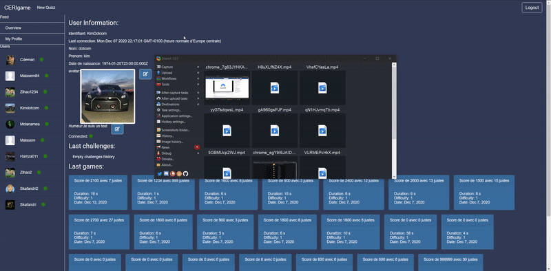

## CERIGame

This website is a easy to use plateform for challenging your friends to quizzes on a wide variety of subjects. Become the best player and obtains all the trophees before your friends.

## Linux commands

* `psql -h pedago01c.univ-avignon.fr -p 5432 -U uapvXXXXXXXX etd`

## Commands

* `nodemon Backend/app.js`
* `cd Frontend/ && npm run ng serve`

## Dependencies

- [NPM](https://nodejs.org/en/download/)
- [NodeJS](https://nodejs.org/en/download/)
- [Angular](https://angular.io/guide/setup-local)
- [MongoDB](https://www.mongodb.com/try/download/community)
- [ExpressJS](https://expressjs.com/fr/)
- [Socket.io](https://socket.io/)
- [Nodemon](https://www.npmjs.com/package/nodemon)
- [RxJS](https://www.npmjs.com/package/rxjs)
- [Jasmine](https://www.npmjs.com/package/jasmine)
